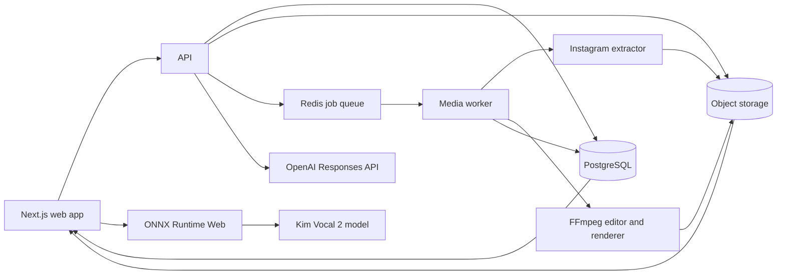

# Editing Site

A planned web application for downloading permitted public Instagram videos, keeping them temporarily in a media library, editing them with a focused set of tools, and saving Instagram-ready exports in a separate section.

> **Planning reference:** This document preserves the full target architecture. Development has started; see the root README for implemented features, current adapters, and remaining work. AI caption generation remains deferred.

## Product goal

The first complete user journey will be:

1. Paste a permitted public Instagram Reel or video-post link.
2. Extract the highest available source, thumbnail, username, and post caption.
3. Save the video and caption temporarily in **Media**.
4. Upload other local videos to the same Media section when needed.
5. Open a video in a non-destructive editor.
6. Crop, add text, choose a font/color, create a mixed-color background, split the timeline, remove unwanted sections, and optionally remove or isolate vocals.
7. Use either text chat or approved timeline screenshots to draft, rewrite, or improve the post caption.
8. Review and manually apply the chosen caption to the project.
9. Render an Instagram-compatible MP4.
10. Save the result in a separate **Edited Videos** section.

Private posts, Stories, login bypasses, DRM bypasses, and bulk account downloads are outside the planned scope.

## System overview



### Proposed stack

| Layer             | Proposed technology                         | Responsibility                                                                      |
| ----------------- | ------------------------------------------- | ----------------------------------------------------------------------------------- |
| Web application   | Next.js + TypeScript                        | Downloader, Media, Editor, and Edited Videos screens                                |
| API               | Node.js + Fastify                           | Validation, signed URLs, projects, jobs, and access control                         |
| Download worker   | Python + `yt-dlp`                           | Public Instagram extraction and metadata                                            |
| Render worker     | FFmpeg                                      | Crop, overlays, split/concat, backgrounds, and Instagram-ready export               |
| Job queue         | Redis + BullMQ                              | Long-running downloads and renders outside web requests                             |
| Database          | PostgreSQL                                  | Metadata, captions, projects, edit instructions, and job state                      |
| File storage      | S3-compatible storage such as Cloudflare R2 | Source videos, uploads, thumbnails, and exports                                     |
| Caption assistant | OpenAI Responses API                        | Text-based caption chat and caption generation from approved timeline frames        |
| Vocal separation  | Kim Vocal 2 ONNX + ONNX Runtime Web 1.21.0  | Client-side vocal isolation/removal through WebGPU with multithreaded WASM fallback |

The web request will never stay open for a full video download or render. The API creates a background job and the browser reads its progress using a job ID.

## Functional areas

### 1. Instagram downloader

- Accept only exact `https://www.instagram.com/reel/...`, `/p/...`, and `/tv/...` URLs.
- Normalize the URL and reject arbitrary hosts before a worker sees it.
- Extract only publicly available media without asking for Instagram passwords or cookies.
- Store title, post caption, creator username, thumbnail, duration, dimensions, and source link.
- Download the highest available video/audio streams and merge them with FFmpeg.
- Automatically create a Media record after completion.
- Use clear states: queued, inspecting, downloading, processing, ready, expired, and failed.

Instagram extraction can fail when Instagram changes internal responses or rate-limits server IPs. The extractor therefore stays isolated in its own worker and can be updated or replaced without changing the editor.

### 2. Media library

The **Media** section will contain:

- completed Instagram downloads;
- videos uploaded from the user's device;
- thumbnail, duration, resolution, size, source type, and expiry;
- the original Instagram caption in an editable field;
- actions to preview, edit, download, or delete an asset.

Decided: downloaded source files remain for **36 hours**, configured through `SOURCE_RETENTION_HOURS`. The deadline is fixed when the source is imported — opening an edit project does not refresh it — and exports expire on the same window from when they were saved. (Earlier drafts of this plan proposed 7 days with refresh on open.)

### 3. Focused video editor

Editing is non-destructive. The source video is never modified; the browser saves a small versioned JSON edit specification.

#### Crop

- Fixed Instagram Reel canvas: `9:16` at `1080 × 1920`; no other aspect-ratio options.
- Optional custom crop box.
- Browser preview stores normalized `x`, `y`, `width`, and `height` values.
- Render worker converts them into FFmpeg `crop` and `scale` filters.

#### Text overlays

- First version is limited to **4 bundled fonts**.
- First version is limited to **5 approved text colors**.
- Controls: text, font, color, size, alignment, position, start time, and end time.
- Font files are bundled in both the web app and render worker so preview and export match.
- Exact font names and five color values will be finalized before editor implementation.

#### Mixed-color background

- Show **5 predefined background-color swatches** directly in the editor for one-click selection.
- Add a native HTML `<input type="color">` for custom background colors.
- Display the selected custom value as an editable hex field such as `#FF3E81`; validate it as a six-digit hex color before saving.
- Support a solid background or a gradient made from two or three color stops.
- Preset and custom colors can be mixed in the same gradient.
- Controls include selected swatches, custom color, color stops, and gradient angle.
- Browser shows a live CSS/canvas preview.
- Worker creates the same gradient and composites the cropped video above it.

#### AI caption assistant

- Add a collapsible **AI Caption** panel inside the editor; it is part of the editor, not a separate page.
- Show two clear modes in a tab or segmented control: **Chat / Rewrite** and **Analyze video**.

##### Mode 1 — Chat / Rewrite

- This is a normal text-only chat. The user can provide an existing caption, paragraph, phrase, rough idea, or direct instruction.
- The assistant can create a new caption, paraphrase the supplied text, or make changes such as shorter, longer, Hindi, Hinglish, English, professional, casual, emoji-light, or hashtag suggestions.
- Preserve a project-specific multi-turn conversation so follow-ups such as “shorter karo” or “more casual” retain the previous suggestion as context.
- Give the assistant only the approved text context: current caption, creator notes, selected tone, language, and the user's messages. Timeline screenshots are not sent in this mode.

##### Mode 2 — Analyze video

- Sample still frames from the project's current edited timeline. Only enabled segments are sampled, so a clip removed with **Delete** is never included.
- Select a small configurable set of representative timestamps; the first version will default to 6 frames and allow 4–8 frames.
- Generate compressed temporary JPEG or WebP screenshots and display them as a timestamped review strip before any AI request is made.
- Let the user remove an unsuitable frame or refresh the selection, then explicitly choose **Generate from video**.
- Send only the approved screenshots, their timestamps, and optional text context to a vision-capable model through multiple Responses API `input_image` items. Do not upload the complete video.
- Generate captions according to visible subjects, actions, setting, and on-screen text. Screenshot analysis alone cannot understand music, spoken dialogue, or other audio; an optional transcript can be added later as a separately disclosed feature.
- Delete temporary screenshots immediately after the response or after a short failure/abandonment TTL. They do not become permanent Media assets.

##### Shared result flow

- Return one to three structured suggestions containing `caption`, `hashtags`, and a short `reason`.
- Provide **Use caption**, **Copy**, and **Try again** actions for every suggestion.
- **Use caption** places the selected result into the normal editable caption field. The user must review and save it; AI never publishes or silently overwrites a caption.
- Store application conversation history in our own database and call the OpenAI Responses API with `store: false`; retention follows the project's own data policy.
- Keep the model configurable through `OPENAI_CAPTION_MODEL` instead of hardcoding a model name.
- Keep `OPENAI_API_KEY` only in the backend secret store. Never expose it in browser JavaScript, return it through an API, or commit it to GitHub.
- Apply per-user message/token limits, timeouts, retry rules, and usage logging to control cost and abuse.

This is an OpenAI API integration, not an embedded ChatGPT website or a connection to the user's personal ChatGPT subscription. API usage and billing belong to the OpenAI API project configured by the application owner.

The Responses API supports text and image inputs, so both modes can share one backend integration while sending different input types.

Sources: [OpenAI Responses API](https://developers.openai.com/api/reference/cli/resources/responses/methods/create), [OpenAI image-input quickstart](https://platform.openai.com/docs/quickstart/make-your-first-api-request), and [OpenAI API authentication guidance](https://platform.openai.com/docs/api-reference/backward-compatibility)

#### Split and remove

- Clicking **Split** adds a boundary at the playhead.
- Timeline becomes a list of `{ startMs, endMs, enabled }` segments.
- **Delete** disables a selected segment without changing the source file.
- Export renders only enabled segments and concatenates them in order.
- Undo/redo uses edit-spec history in the browser.

#### Client-side vocal removal

The editor's **Audio** panel will offer **Original**, **Remove vocals**, **Keep vocals only**, and **Mute**. Vocal processing is non-destructive: the source video remains unchanged and the project stores the selected audio mode plus a generated derivative when required.

- Use the MIT-licensed [Kim Vocal 2 ONNX model](https://huggingface.co/Blane187/all_public_uvr_models/blob/main/Kim_Vocal_2.onnx), an MDX-Net vocal-isolation model. The current model artifact is approximately 66.8 MB.
- Pin the initially tested runtime to `onnxruntime-web@1.21.0`; update it only after audio-quality and performance regression tests.
- Run inference in the user's browser. Deployment does not use the hosting server's CPU/GPU: WebGPU uses the user's GPU and WASM uses the user's CPU.
- Prefer WebGPU when available by loading the WebGPU build and creating the session with `executionProviders: ["webgpu", "wasm"]`; otherwise use WASM.
- Configure the WASM fallback for up to four threads. Multithreading requires WebAssembly thread support and `crossOriginIsolated === true`.
- Serve production over HTTPS and set `Cross-Origin-Opener-Policy: same-origin` plus `Cross-Origin-Embedder-Policy: require-corp`. Verify all CDN or third-party assets remain compatible with these headers.
- Run resampling, STFT, ISTFT, denoising, and overlap-add inside a dedicated Web Worker so the editor UI stays responsive. ONNX Runtime threading does not automatically parallelize custom JavaScript DSP.
- Show the detected engine (`WebGPU` or `WASM · N threads`), model-download progress, separation progress, elapsed time, a cancel action, and a **Result may vary** notice.
- Generate a short preview before the user applies the result. After approval, upload only the selected derived audio stem through a signed URL so the render worker can use it in the final export.
- Cache the pinned model in IndexedDB after its first verified download. For production reliability, mirror the versioned model and matching ONNX Runtime/WASM assets under an application-controlled origin instead of depending on unversioned CDN URLs.
- Preserve the Kim Vocal 2 model's MIT license notice and attribution in the deployed application.

The validated audio pipeline must remain parameter-compatible with the model contract:

- resample stereo audio to `44100 Hz`;
- use `n_fft=7680`, `hop_length=1024`, `dim_f=3072`, and `dim_t=256`;
- split audio into `261120`-sample chunks (about 5.9 seconds) with 25% overlap;
- transform each chunk into a `[1, 4, 3072, 256]` tensor ordered as left-real, left-imaginary, right-real, and right-imaginary;
- run positive and negated spectrogram passes, then combine them as `negative * -0.5 + positive * 0.5`;
- reconstruct with ISTFT and weighted overlap-add, then join chunks with a Hann-window crossfade;
- process chunks sequentially by default to bound browser memory, while reporting progress between chunks.

Because the denoise mode performs two inference passes per chunk, it improves separation quality at roughly double the model-inference work. WebGPU should remain the preferred path for this mode. Weak devices can fall back to WASM, but the UI must warn that longer videos may take substantially more time.

Sources: [ONNX Runtime WebGPU guide](https://onnxruntime.ai/docs/tutorials/web/ep-webgpu.html), [ONNX Runtime Web environment and session options](https://onnxruntime.ai/docs/tutorials/web/env-flags-and-session-options.html), and [ONNX Runtime Web deployment guide](https://onnxruntime.ai/docs/tutorials/web/deploy.html)

Example edit specification:

```json
{
  "version": 1,
  "canvas": {
    "aspectRatio": "9:16",
    "background": {
      "type": "gradient",
      "colors": ["#FF3E81", "#7A5CFF"],
      "angle": 135
    }
  },
  "crop": { "x": 0.08, "y": 0, "width": 0.84, "height": 1 },
  "segments": [
    { "startMs": 0, "endMs": 8200, "enabled": true },
    { "startMs": 8200, "endMs": 11600, "enabled": false },
    { "startMs": 11600, "endMs": 24000, "enabled": true }
  ],
  "audio": {
    "mode": "remove-vocals",
    "derivativeId": "audio-derivative-id"
  },
  "textOverlays": [
    {
      "text": "Sample text",
      "fontId": "font-1",
      "colorId": "color-1",
      "x": 0.5,
      "y": 0.12,
      "size": 48,
      "startMs": 500,
      "endMs": 5000
    }
  ]
}
```

### 4. Edited Videos

- Every successful render creates a new immutable export record.
- Source video and edit project remain separate.
- Show thumbnail, export date, duration, resolution, size, and originating project.
- Actions: preview, download, duplicate edit, rename, or delete.
- Edited exports remain until the user deletes them or a future account/storage policy is introduced.

## Instagram export profile

The main target is a video that can be uploaded as an Instagram Reel or video post. The initial safe preset will use:

- MP4 container;
- H.264/AVC video;
- AAC audio at 48 kHz;
- `yuv420p` pixel format and even dimensions;
- 30 fps by default;
- `9:16` and `1080 × 1920` as the only supported Reel canvas;
- video bitrate below Instagram's documented maximum;
- MP4 `faststart` metadata for reliable upload/preview.

Meta's current Reels publishing documentation allows MOV or MP4, H.264 or HEVC video, AAC audio, 23–60 fps, up to 1920 horizontal pixels, and recommends a 9:16 aspect ratio. It currently documents a 25 Mbps maximum video bitrate, 128 kbps audio bitrate, 3-second minimum, 15-minute maximum, and 1 GB maximum file size. These limits must be kept in configuration and rechecked before production releases because platform rules can change.

Source: [Meta Instagram API documentation](https://www.postman.com/meta/instagram/documentation/6yqw8pt/instagram-api)

## Planned data model

| Entity                  | Important fields                                                                                         |
| ----------------------- | -------------------------------------------------------------------------------------------------------- |
| `users`                 | `id`, identity-provider ID, timestamps                                                                   |
| `media_assets`          | owner, source type, object key, thumbnail key, caption, duration, dimensions, size, status, `expires_at` |
| `edit_projects`         | owner, source asset, name, `edit_spec` JSONB, version, timestamps                                        |
| `audio_derivatives`     | owner, project, mode, object key, sample rate, duration, size, status, `expires_at`                      |
| `ai_caption_threads`    | owner, project, selected tone/language, created and updated times                                        |
| `ai_caption_messages`   | thread, mode, role, sanitized content, response ID, token usage, timestamp                               |
| `caption_analysis_jobs` | owner, project, selected timestamps, temporary frame keys, status, error, `expires_at`                   |
| `render_jobs`           | project, status, progress, error code, attempts, worker timestamps                                       |
| `exports`               | owner, project, object key, thumbnail key, duration, dimensions, size, created time                      |

Object keys are generated by the server:

```text
users/{userId}/sources/{assetId}/source.mp4
users/{userId}/sources/{assetId}/thumbnail.jpg
users/{userId}/exports/{exportId}/video.mp4
users/{userId}/exports/{exportId}/thumbnail.jpg
```

Clients receive short-lived signed URLs and never receive storage credentials.

## Planned API surface

| Method   | Route                                                | Purpose                                                                   |
| -------- | ---------------------------------------------------- | ------------------------------------------------------------------------- |
| `POST`   | `/api/downloads/inspect`                             | Validate link and return available metadata                               |
| `POST`   | `/api/downloads`                                     | Create a permitted Instagram download job                                 |
| `GET`    | `/api/jobs/:jobId`                                   | Read download/render progress                                             |
| `GET`    | `/api/media`                                         | List active Media assets                                                  |
| `POST`   | `/api/media/uploads`                                 | Create an upload and return a signed upload URL                           |
| `PATCH`  | `/api/media/:assetId`                                | Update caption or display name                                            |
| `DELETE` | `/api/media/:assetId`                                | Delete an owned source asset                                              |
| `POST`   | `/api/projects`                                      | Create an edit project from a Media asset                                 |
| `PATCH`  | `/api/projects/:projectId`                           | Save the validated edit specification                                     |
| `POST`   | `/api/projects/:projectId/audio-derivatives/uploads` | Create a signed upload for a user-approved client-side audio stem         |
| `GET`    | `/api/projects/:projectId/caption-chat`              | Load the project's caption conversation                                   |
| `POST`   | `/api/projects/:projectId/caption-chat/messages`     | Send a prompt and stream structured caption suggestions                   |
| `POST`   | `/api/projects/:projectId/caption-chat/apply`        | Apply a selected suggestion to the editable project caption               |
| `POST`   | `/api/projects/:projectId/caption-analysis/frames`   | Queue timeline-frame extraction and return a reviewable frame batch       |
| `POST`   | `/api/projects/:projectId/caption-analysis/generate` | Send the user's approved frames and return structured caption suggestions |
| `POST`   | `/api/projects/:projectId/renders`                   | Queue an Instagram-ready export                                           |
| `GET`    | `/api/exports`                                       | List Edited Videos                                                        |
| `DELETE` | `/api/exports/:exportId`                             | Delete an owned export                                                    |

Every asset/project lookup includes the authenticated owner ID; knowing another record's UUID must never grant access.

## Reliability and safety

- Require an ownership/permission confirmation before an Instagram download.
- Add per-user and per-IP rate limits.
- Use random job and object IDs; never use user input as a filesystem path.
- Enforce duration, file-size, resolution, bitrate, and render-time limits.
- Run `yt-dlp` and FFmpeg with argument arrays, not shell-interpolated commands.
- Isolate workers from the public API and restrict outbound hosts.
- Use signed object URLs, encrypt secrets, and redact extractor logs.
- Keep the OpenAI API key server-side and out of client bundles, logs, and repository files.
- Send only the minimum caption context needed; video analysis sends reviewed screenshots, not the complete source video.
- Require explicit user action before reviewed frames are sent to OpenAI, never sample disabled timeline segments, and purge temporary analysis frames after use or expiry.
- Keep vocal separation client-side; upload a derived stem only after user approval, validate its type/size/duration, and restrict its signed URL to the owning project.
- Enable COOP/COEP headers for WASM multithreading and test that every required cross-origin asset is served with compatible CORS/CORP headers.
- Rate-limit AI requests and record per-user usage/cost metadata without logging secrets.
- Automatically remove expired sources and failed partial uploads.
- Make cleanup idempotent so database and storage retries are safe.
- Maintain a report/takedown path and download only content the user owns or has permission to use.

## Branch strategy

| Branch                         | Purpose                                                                                             |
| ------------------------------ | --------------------------------------------------------------------------------------------------- |
| `main`                         | Stable planning and production-ready releases                                                       |
| `develop`                      | Integration branch for completed feature work                                                       |
| `feature/instagram-downloader` | Link inspection, download jobs, caption extraction, and source normalization                        |
| `feature/media-library`        | Uploads, temporary storage, caption editing, and Media UI                                           |
| `feature/video-editor`         | Crop, text, colors, backgrounds, timeline tools, Kim Vocal 2 separation, and edit JSON              |
| `feature/ai-caption-assistant` | Text chat/rewrite, reviewed timeline-frame analysis, structured suggestions, limits, and apply flow |
| `feature/export-library`       | Render queue, Instagram-compatible exports, and Edited Videos UI                                    |
| `infra/platform`               | Database, Redis, object storage, authentication, deployment, and observability                      |

Feature branches start from `develop`. Small pull requests merge into `develop`; tested release candidates merge from `develop` into `main`.

## Delivery roadmap

### Phase 1 — platform foundation

- Next.js application shell and authentication.
- PostgreSQL schema and ownership rules.
- Object-storage uploads and signed downloads.
- Redis queue and worker health reporting.

### Phase 2 — downloader and Media

- Public Instagram link inspection.
- Background download and progress.
- Caption/thumbnail storage.
- Media screen, uploads, retention, and cleanup.

### Phase 3 — editor

- Video preview and timeline.
- Crop presets and custom crop.
- Four-font and five-color text system.
- Five direct background-color options, an HTML custom-color input, and hex gradients.
- Split, remove, undo, redo, and autosave.
- Kim Vocal 2 client-side vocal separation, WebGPU/WASM selection, worker-based DSP, preview/apply, and derivative upload.
- AI caption mode 1: text chat, rewrite/paraphrase, multi-turn refinement, and manual apply/save flow.
- AI caption mode 2: enabled-timeline frame sampling, user review, visual caption generation, and temporary-frame cleanup.

### Phase 4 — render and Edited Videos

- Validate edit JSON on the API and worker.
- Generate FFmpeg filter graphs.
- Instagram-compatible export preset.
- Render progress, retries, and cancellation.
- Edited Videos library and download flow.

### Phase 5 — production hardening

- Abuse limits, storage quotas, monitoring, and alerts.
- Instagram upload compatibility checks.
- Failure recovery, cleanup audits, and end-to-end tests.

## Decisions to finalize before implementation

- Authentication method: email/password, Google, or another provider.
- ~~Exact source retention period~~ — decided: 36 hours, fixed at import, no refresh on open.
- Names/files for the four bundled fonts.
- Exact five approved text colors.
- Exact five predefined background colors; custom colors will use `<input type="color">`.
- Maximum audio/video duration for client-side vocal separation and the minimum supported device-memory profile.
- Whether the production deployment will self-host the pinned Kim Vocal 2 and ONNX Runtime assets or use a controlled CDN with compatible cross-origin headers.
- OpenAI API model, monthly budget, per-user quota, and chat-retention period.
- Whether a future audio/dialogue transcript should be offered as an explicit opt-in addition to screenshot analysis; it is not part of the first visual-only version.
- Cloud provider for PostgreSQL, Redis, object storage, web app, and workers.
- Free-plan duration/storage limits and whether paid plans are needed.
